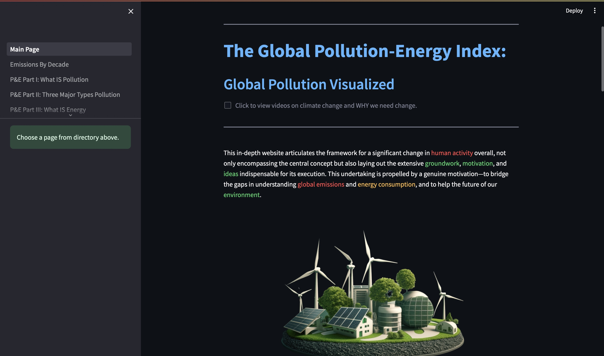

# Global Pollution-Energy Index

This repository contains the necessary information and work for the 2024 spring semester senior thesis. 

In this repository, you will find the abstract.md which houses the abstract of the project, the thesis.md which holds the thesis of a 7500 word minnimum, and also the README.md, this file, explaining how to use this project.

Additionally, in order to run the project, you must download the repository [here.](https://github.com/ReadyResearchers-2023-24/Anthony-Vazquez-Artifact)

Once downloaded and the user is in their terminal, they will need to use the `cd` command and run `cd Anthony-Vazquez-Artifact` to get into the repository housing the project, then run `cd src` to get to the coded files. Once there, one las command must be run `streamlit run Main_Page.py` in order to run the project.

You should see a home screen that looks like this:

From this home page, you will see an overview of what the website is about and some of the goals that it has. There are also informational videos at the top and bottom of this page, you can view them by clicking the checkbox:

Once you have read through the first page and watched any videos, you can move onto the next page, which is Emissions by Decade for the years 1750-2020.

That page should look like this:

There is plenty of information on this page, and it is also interesting to watch the emissions rise at certain times within a century, especially when one can relate the rise or fall in emissions to a real-world event.

Once this page has been viewed, you can start learning about Pollution and Energy:

Each of the pages labeled 'P&E' or 'Pollution & Energy' have relatively the same layout, so only showing one here gives the user an idea of what to expect for each instance. There will be a topic paragraph, usually followed by a video or two, and after that is a more in-depth description of the topic that is then followed by more informational videos on the subject.

Once the user is finished running the program, they can hold the control key, and press the 'c' key with it, this will stop running the program. Then, the user can exit out of the window for the website as well.
